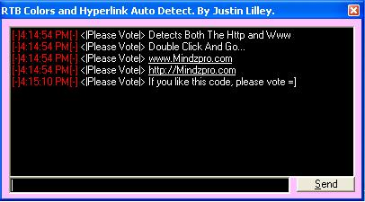



## Auto Detect Hyperlinks In a RTB\!

### Description

This is simply AMAZING! With a Rich Text Box learn how to auto detect hyperlinks and have COLOR! Also a very slick send command that adds text to the Rich Text Box with the time and the name of your choice. =) If you do like the code i would like it if voted. Thanks and happy coding!
 
### More Info
 

             |
---                |---
**Submitted On**   |2004-11-23 16:12:24
**By**             |[Justin Lilley](https://github.com/Planet-Source-Code/PSCIndex/blob/master/ByAuthor/justin-lilley.md)
**Level**          |Intermediate
**User Rating**    |4.0 (8 globes from 2 users)
**Compatibility**  |VB 6\.0
**Category**       |[Coding Standards](https://github.com/Planet-Source-Code/PSCIndex/blob/master/ByCategory/coding-standards__1-43.md)
**World**          |[Visual Basic](https://github.com/Planet-Source-Code/PSCIndex/blob/master/ByWorld/visual-basic.md)
**Archive File**   |[Auto\_Detec18212111232004\.zip](https://github.com/Planet-Source-Code/justin-lilley-auto-detect-hyperlinks-in-a-rtb__1-57389/archive/master.zip)

